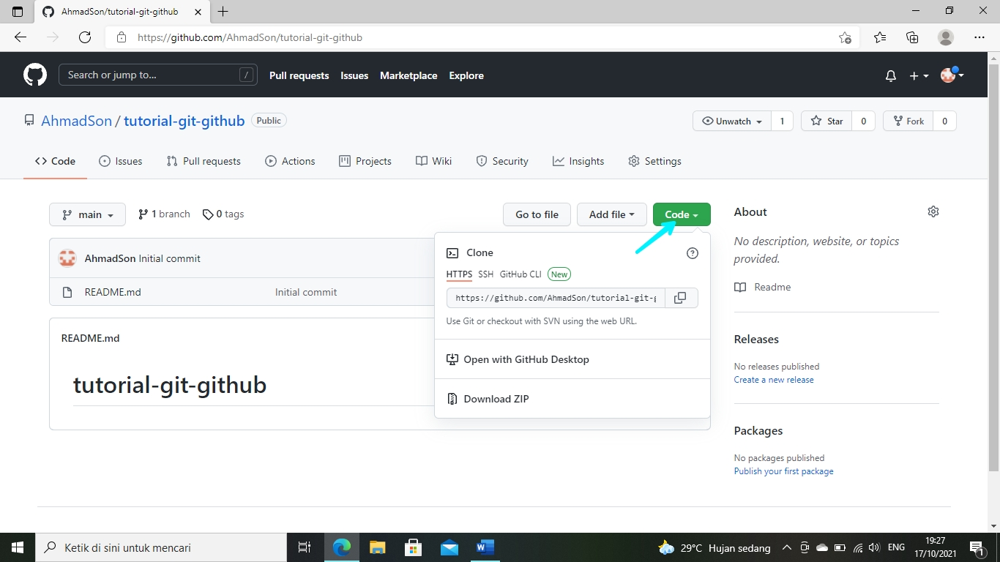

# tutorial-git-github
## Cara Menggunakan Git pada Github
### Bahan yang dibutuhkan

- [Github](https://github.com)

- [Git-scm](http://git-scm.com/)

- [Visual Studio Code](https://code.visualstudio.com)

### Membuat Github

#### Pertama buka situs [Github](https://github.com)

- pilih Sign up, jika belum memiliki akun

- pilih Sign in, jika sudah memiliki akun

#### Setelah login nanti akan muncul seperti gambar di bawah

- Lalu Klik Creat Repository

#### Setelah itu kalian akan di minta untuk membuat nama Repository kalian

- Deskripsi boleh kosong

- Ceklis Add a README file

- lalu klik repository, seperti gambar di bawah

<b>Setelah Muncul Seperti Gambar di Bawah</b>
- Klik code, untuk link nya kalian bisa pakai HTTPS,SSH, atau Github CLI, lalu kalian copy link tersebut

<b>Jika kalian belum memiliki</b> [git-scm](http://git-scm.com/), <b>kalian bisa download dan install terlebih dahulu</b>

- klik <b>Download for Windows</b>

- lalu install seperti biasa, next saja

- setelah itu buat folder kosong untuk menyimpan file kerja kita

- lalu klik kanan pada Folder yang kita buat pilih <b>Git Bash Here</b>

- Kemudian copy link HTTPS Github kalian

- lalu klik Enter

